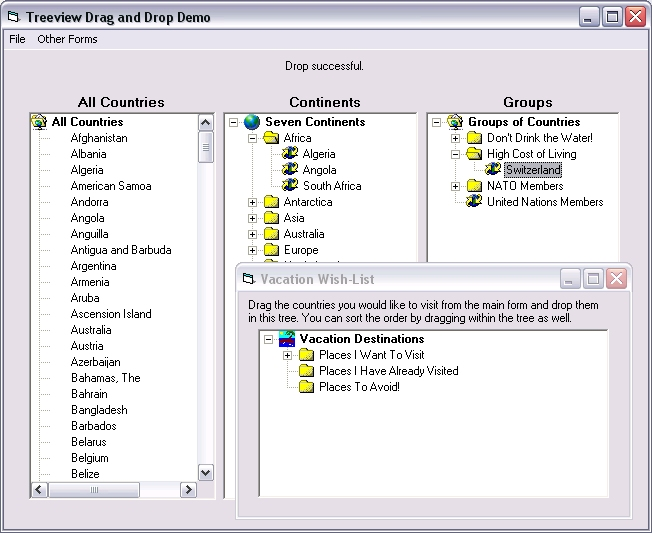



## Treeview OLEDragDrop Demo

### Description

Demo that shows how to create a custom drag format, dragging between treeviews and different forms, auto-expanding and auto-scrolling nodes, changing node images, validating data before dropping, plus several other little tricks. Demo gets a list of countries from the user's registry to use as data to make the demo more like a 'real life' program.
 
### More Info
 
Requires Microsoft Windows Common Controls 6.0

             |
---                |---
**Submitted On**   |2004-04-15 17:05:28
**By**             |[Brent Culpepper](https://github.com/Planet-Source-Code/PSCIndex/blob/master/ByAuthor/brent-culpepper.md)
**Level**          |Intermediate
**User Rating**    |5.0 (30 globes from 6 users)
**Compatibility**  |VB 6\.0
**Category**       |[OLE/ COM/ DCOM/ Active\-X](https://github.com/Planet-Source-Code/PSCIndex/blob/master/ByCategory/ole-com-dcom-active-x__1-29.md)
**World**          |[Visual Basic](https://github.com/Planet-Source-Code/PSCIndex/blob/master/ByWorld/visual-basic.md)
**Archive File**   |[Treeview\_O1733894152004\.zip](https://github.com/Planet-Source-Code/brent-culpepper-treeview-oledragdrop-demo__1-53182/archive/master.zip)

